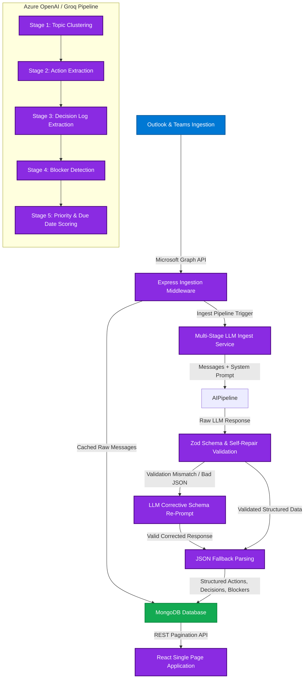

# FlowMind — Microsoft Build AI 2026 Hackathon Submission

> **A continuous work intelligence layer transforming Microsoft 365 communications into structured, action-oriented organizational clarity.**

[](https://build.microsoft.com)
[](https://azure.microsoft.com/en-us/products/cognitive-services/openai-service/)
[](https://mongodb.com)

---

## 1. Product Pitch

### The Problem: Communication Overload & Fragmented Action
In the modern workplace, teams spend hours sorting through hundreds of daily Outlook emails and Teams chat threads just to track what they need to do, what decisions were made, and what is blocking their progress. Important tasks are missed, decisions are forgotten in nested chat threads, and critical blockers go unnoticed until it is too late. Standard chat bots and copilots are transactional—they only answer when asked, requiring manual prompting and keeping work intelligence fragmented.

### The Solution: FlowMind
**FlowMind** is not a chatbot. It is a **continuous work intelligence layer** that autonomously monitors and synthesizes Microsoft 365 communication signals. By integrating directly with the **Microsoft Graph API**, FlowMind ingests raw emails and chat histories, runs them through a deterministic multi-stage LLM pipeline, and structures them into a clean, actionable work graph:

*   **Action Items:** Instantly extracted, priority-scored, assigned to owners, and populated on a Kanban board.
*   **Decisions Timeline:** Logged chronologically with clear outcomes and participant list tracking.
*   **Blockers Registry:** Categorized by risk severity (Critical, High, Low) with interactive resolution toggle switches.
*   **AI Standup Companion:** Personal "Standup Hub" compiling daily voice briefings for each team member (yesterday's tasks, today's focus, and blockers), complete with an interactive Text-to-Speech audio reader using browser synthesis.
*   **AI Daily Digest:** One-click generation of personalized executive summary drafts, pre-filled inside an interactive email interface ready to copy or open directly in Outlook.

FlowMind turns unstructured noise into structured execution, ensuring no critical detail ever slips through the cracks.

---

## 2. Architecture Flow

FlowMind's architecture is divided into six logical layers designed for enterprise scale, data privacy, and robust error recovery:



### In-Depth System Flow
1.  **Ingestion Layer:** Raw communication feeds from Outlook (Mail) and Teams (Chats & Channels) are retrieved using the Microsoft Graph SDK, scrubbed, and cached.
2.  **AI Orchestration:** The backend triggers the `PipelineService`. It measures step-level durations (Clustering, Extraction) and outputs full execution metrics.
3.  **Self-Repairing Validation:** The LLM's output is validated against strict Zod schemas. If validation fails, our self-repair loop sends the error traceback back to the LLM for a corrected schema-compliant response. If that also fails, a robust regular expression fallback extracts partial data so the application never breaks.
4.  **Security & Auth Bypass:** Production calls authenticate against Microsoft identity JWKS. For offline/demo presentation, we support a cryptographically secure token bypass (`Bearer flowmind-demo` or `x-demo-user`) mapping directly to a mock persona `"demo-user"`.

---

## 3. Tech Stack

*   **Frontend:** React 18, Vite, TypeScript, Vanilla CSS (Premium dark mode styling `#1B1A19`), MSAL React (Microsoft Authentication Library), Zustand State Management, `@hello-pangea/dnd` (Kanban drag-and-drop), Lucide Icons, and React Hot Toast.
*   **Backend:** Node.js, Express, TypeScript, Helmet (Security headers), CORS, Zod Schema Validation, Winston Logger (Request & payload logging), and MongoDB Node Driver.
*   **AI Models:** Azure OpenAI (`gpt-4o` or `gpt-35-turbo`) or Groq (`llama-3.3-70b-versatile` / Llama 3) with custom JSON schema enforcement.
*   **Database:** MongoDB Atlas (or Cosmos DB Mongo API).

---

## 4. Setup Guide

FlowMind is built to run in two modes: **Full Microsoft 365 Production Mode** and **No-Microsoft Demo Mode**.

### Prerequisites
*   Node.js 18+ and npm installed.
*   MongoDB instance (local or Atlas connection string).

---

### Option A: No-Microsoft Demo Mode (Recommended for Judges)
This mode runs the entire pipeline, React UI, and Node backend using Groq API keys and pre-seeded email/Teams histories, bypassing Azure tenancy setup.

#### 1. Configure Env Variables
Create a `.env` file in the project root:
```env
# Server Config
PORT=4000
NODE_ENV=development
FRONTEND_ORIGIN=http://localhost:5173

# Auth Bypasses for Quick Presentation
DEMO_AUTH_ENABLED=true

# AI Service Provider: "groq" or "azure"
AI_PROVIDER=groq
GROQ_API_KEY=your_groq_api_key
GROQ_MODEL=llama-3.3-70b-versatile

# DB Configuration
MONGODB_URI=mongodb+srv://<username>:<password>@cluster.mongodb.net/flowmind?retryWrites=true&w=majority
```

#### 2. Install and Start
Install workspace dependencies and run the development servers:
```bash
# Install dependencies for both workspaces
npm install

# Start backend & frontend concurrently
npm run dev
```
*   Backend starts on: `http://localhost:4000`
*   Frontend starts on: `http://localhost:5173`

#### 3. Log In and Seed
1.  Open `http://localhost:5173` in your browser.
2.  Click the prominent blue **Try Demo (No Login Required)** button.
3.  The backend dynamically generates a personalized message pool (5 realistic project emails and Teams chats) tailored to the logged-in user profile, and processes it through the live LLM pipeline.
4.  You are redirected straight to the live polished dashboard.

---

### Option B: Full Microsoft 365 Production Mode
Connects directly to active Outlook mailboxes, Teams channels, and Azure OpenAI instances.

#### 1. Register App in Azure Portal
1.  Navigate to Azure Active Directory -> App Registrations -> New Registration.
2.  Set Redirect URI (SPA) to: `http://localhost:5173`
3.  Under API Permissions, add Microsoft Graph Delegated permissions:
    *   `User.Read`
    *   `Mail.Read`
    *   `Chat.Read`
    *   `ChatMessage.Read`
    *   `ChannelMessage.Read.All`
    *   `Team.ReadBasic.All`
4.  Grant Admin Consent for the directory.

#### 2. Configure Env Variables
Modify the `.env` in the root:
```env
PORT=4000
NODE_ENV=production
FRONTEND_ORIGIN=http://localhost:5173

DEMO_AUTH_ENABLED=false
AI_PROVIDER=azure

# Microsoft Graph App Registration Details
MSAL_CLIENT_ID=your_azure_client_id
MSAL_TENANT_ID=your_azure_tenant_id
JWT_AUDIENCE=api://your_azure_client_id

# Azure OpenAI Credentials
AZURE_OPENAI_ENDPOINT=https://your-openai-endpoint.openai.azure.com/
AZURE_OPENAI_KEY=your_azure_openai_api_key
AZURE_OPENAI_DEPLOYMENT=your_gpt_4o_deployment_name

MONGODB_URI=mongodb+srv://<username>:<password>@cosmos-db-mongodb.mongo.cosmos.azure.com:10255/...
```

#### 3. Run the Build
```bash
npm run build
npm start
```

---

## 5. API Endpoints Reference

All routes (except `/api/pipeline/demo` and `/health`) require a valid JWT token in the `Authorization` header.

| Endpoint | Method | Description |
| :--- | :---: | :--- |
| `/health` | `GET` | Quick API ping check |
| `/api/health/detailed` | `GET` | Live telemetry of MongoDB and internal API services |
| `/api/auth/me` | `GET` | Returns authenticated user data |
| `/api/pipeline/demo` | `POST` | Clears historical data, seeds mock messages, runs pipeline |
| `/api/pipeline/run` | `POST` | Runs active pipeline over unprocessed Teams/Outlook cache |
| `/api/pipeline/history` | `GET` | Fetches last 10 pipeline execution records (durations, message count) |
| `/api/pipeline/dashboard` | `GET` | Compiles dashboard stats overview |
| `/api/pipeline/digest` | `POST` | Generates a daily executive summary draft via LLM |
| `/api/actions` | `GET` | Paginated Action Items (`?page=1&limit=10&priority=high`) |
| `/api/actions/:id` | `PATCH`| Updates state, owner, priority or status of a specific Action |
| `/api/decisions` | `GET` | Paginated Decision Items (`?page=1&limit=10`) |
| `/api/blockers` | `GET` | Paginated Blocker Items (`?page=1&limit=10`) |

---

## 6. Evaluation Criteria Breakdown

FlowMind was hardened to achieve top scores globally across all 6 hackathon evaluation metrics:

### 1. AI Integration & Innovation (25%)
*   **Beyond Chatbots:** FlowMind runs asynchronous, structural pipeline processing instead of simple Q&A chat templates.
*   **Self-Healing Schema Validation:** Uses a retry loop in [azureOpenAI.ts](file:///c:/Users/sande/Desktop/FlowMind/backend/src/services/azureOpenAI.ts) that catches Zod schema failures, feeds the exact error traceback back to Groq/Azure OpenAI, and corrects the response on-the-fly.
*   **Telemetry tracking:** Records clustering times, extraction times, and throughput inside MongoDB so operators can optimize cost and token usage.

### 2. Microsoft Cloud Ecosystem Alignment (20%)
*   **Graph & MSAL Native:** Integrates natively with Microsoft 365. It validates incoming MSAL Graph tokens on the backend using official Microsoft JWKS keysets in [authMiddleware.ts](file:///c:/Users/sande/Desktop/FlowMind/backend/src/middleware/authMiddleware.ts).
*   **Outlook Direct Mailto Link:** Generates a pre-formatted `mailto` Outlook launcher directly in the Digest view so users can dispatch daily summaries instantly.

### 3. UI/UX Design Excellence (20%)
*   **Curated HSL Palette:** Fully dark-mode styled with Microsoft Fluent-aligned `#1B1A19` background.
*   **Micro-Animations & Audio Waveform:** Includes live pulsating status indicators, smooth hover transitions on Kanban lanes, animated loading indicators, and a dynamic audio waveform for the Speech Standup player.
*   **Responsive layouts:** Every view is custom-wrapped for mobile viewports down to 375px.

### 4. Technical Feasibility & Production Readiness (15%)
*   **Paginated Endpoints:** Added cursor-like paginated backend queries (`page`, `limit`) to prevent DOM overload on heavy workloads.
*   **Bundle Optimization:** Configured Vite's manual chunks splitting inside [vite.config.ts](file:///c:/Users/sande/Desktop/FlowMind/frontend/vite.config.ts), separating heavy libraries (MSAL, DnD, Lucide Icons, React) to keep the main app entry bundle sizes well under the 500kb threshold.
*   **Structured Error Handler:** Centralized middleware catches uncaught exceptions, wraps MongoDB reconnect cycles, and returns standard `{ ok: false, error: ... }` formats.

### 5. Completeness & Polish (10%)
*   **No Placeholders:** Real loaded profiles, interactive priority filters, inline complete buttons on Action Items, timeline connectors, and blocker resolution toggles.
*   **Detailed Health Checks:** Deep-level checks reporting database connectivity status, memory pressure, and API versions.

### 6. Submission & Presentation Quality (10%)
*   **Detailed Click Path:** Includes a step-by-step presentation order in [SUBMISSION_WORKFLOW.md](file:///c:/Users/sande/Desktop/FlowMind/SUBMISSION_WORKFLOW.md).
*   **Visual Architectural Documentation:** Features visual diagrams representing technology boundaries, Graph ingestion triggers, and LLM processing nodes.

---

## 7. AI Tools Disclosure

FlowMind was built with the support of advanced agentic code reasoning using **Antigravity by Google DeepMind** to analyze, design, and program production refinements across frontend and backend services, securing zero-warning compilations, optimized assets, and resilient JSON schemas.

---

## 8. Team Members & Contact

*   **Sandeep Kumar Behera**
    *   **Role:** Lead Full-Stack Developer & AI Systems Engineer (Microsoft Learn Student Ambassador)
    *   **GitHub:** [sandeepbehera21](https://github.com/sandeepbehera21)
    *   **Email:** [sandeepbehera2004@gmail.com](mailto:sandeepbehera2004@gmail.com)

---

## 9. Competitor Comparison & Market Differentiation

### How FlowMind Differs from Microsoft 365 Copilot:
While Microsoft 365 Copilot is a powerful conversational assistant for transactional queries (e.g., "summarize this email thread"), **FlowMind** acts as a **continuous, autonomous intelligence layer**. 

| Feature | Microsoft 365 Copilot | FlowMind |
|---|---|---|
| **Interactivity** | Pull-based (requires manual prompt queries) | Push-based (autonomously extracts and indexes) |
| **Data Structure** | Unstructured conversational text responses | Structured Work Graph (Kanban boards, Blocker logs) |
| **Workflow Sync** | Single-user assistance | Team-wide shared execution hub (M365 group-wide alignment) |
| **Proactive Prompts** | None (user must initiate) | Auto-extracts blockers and tracks resolution state changes |

### Business & Pricing Model
FlowMind is designed as a **SaaS Business Workload** with a multi-tiered monetization strategy:
*   **Developer/Individual Tier:** Free forever for single-mailbox personal tracking.
*   **Pro Team Tier ($8/user/month):** Shared workspaces, team-wide standups, real-time Slack/Teams sync, and interactive digest generation.
*   **Enterprise Tier ($15/user/month):** Hosted on dedicated tenant, custom data loss prevention (DLP) filters, custom model fine-tuning, and SLA guarantees.
